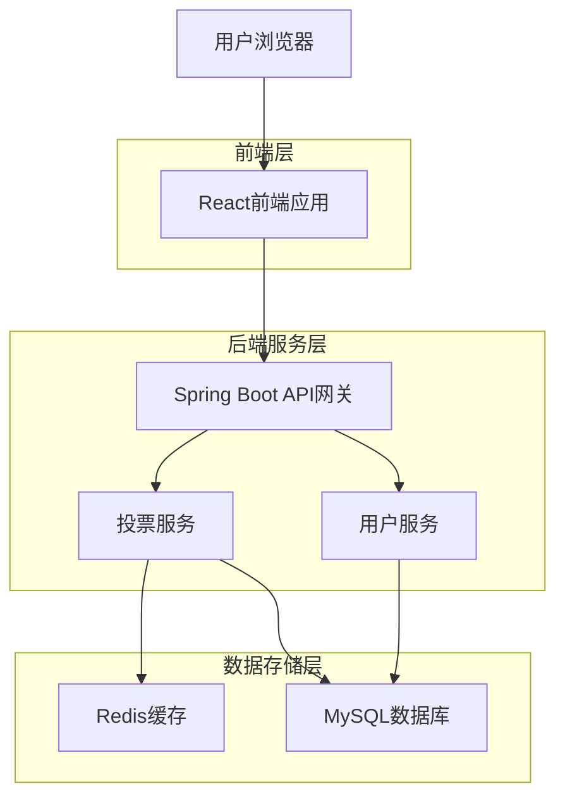
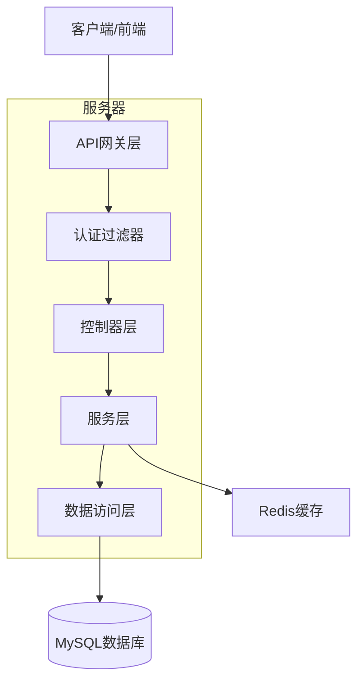
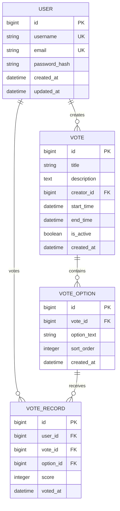

## 说明

本文档保留为当前实现的架构说明。若与历史规划冲突，以源码、`README.md` 与 `api_contract.md` 为准。

## 1.架构设计



## 2.技术描述

- 前端：React@18 + Ant Design + Vite
- 初始化工具：vite-init
- 后端：Spring Boot@3.2 + Spring Security + Spring Data JPA
- 数据库：MySQL@8.0
- 缓存/幂等：Redis@7.0（当前用于投票幂等与部分结果缓存）
- 构建工具：Maven

## 3.路由定义

| 路由 | 用途 |
|-------|---------|
| / | 首页，显示投票列表和导航 |
| /login | 登录页面，用户身份验证 |
| /register | 注册页面，新用户注册 |
| /vote/:id | 投票详情页面，显示投票选项和进行投票 |
| /admin | 管理与创建中心；已登录用户可创建投票，管理员额外看到概览与用户管理 |

## 4.API定义

### 4.1 用户认证API

用户注册
```
POST /api/auth/register
```

请求：
| 参数名 | 参数类型 | 是否必需 | 描述 |
|-----------|-------------|-------------|-------------|
| username | string | true | 用户名 |
| email | string | true | 邮箱地址 |
| password | string | true | 密码 |

响应：
| 参数名 | 参数类型 | 描述 |
|-----------|-------------|-------------|
| success | boolean | 注册状态 |
| message | string | 响应消息 |
| data | object | 用户数据 |

用户登录
```
POST /api/auth/login
```

请求：
| 参数名 | 参数类型 | 是否必需 | 描述 |
|-----------|-------------|-------------|-------------|
| username | string | true | 用户名或邮箱 |
| password | string | true | 密码 |

### 4.2 投票API

获取投票列表
```
GET /api/votes
```

创建投票
```
POST /api/votes
```

进行投票
```
POST /api/votes/{id}/vote
```

请求：

- `CHOICE` 模式：`optionIds: number[]`
- `SLIDER` 模式：`optionScores: Record<number, number>`

添加选项
```
POST /api/votes/{id}/options
```

请求：
| 参数名 | 参数类型 | 是否必需 | 描述 |
|-----------|-------------|-------------|-------------|
| text | string | true | 选项内容 |
| maxScore | integer | false | 满分(仅滑块模式有效) |

响应：
| 参数名 | 参数类型 | 描述 |
|-----------|-------------|-------------|
| success | boolean | 状态 |
| data | object | 选项数据 |

获取投票结果
```
GET /api/votes/{id}/results
```

邀请码与管理相关接口：

```text
POST /api/votes/{voteId}/join
POST /api/votes/join
POST|DELETE /api/votes/{voteId}/leave
GET /api/votes/{voteId}/invite
POST /api/votes/{voteId}/invite/reset
PUT|PATCH /api/votes/{voteId}/invite/settings
```

管理员接口：

```text
GET /api/admin/dashboard
POST /api/admin/confirm
POST /api/admin/confirmations
GET /api/admin/users
PUT|PATCH /api/admin/users/{userId}
PUT|PATCH /api/admin/users/{userId}/role
PUT|PATCH /api/admin/users/{userId}/status
DELETE /api/admin/users
PUT|PATCH /api/admin/votes/{voteId}/rule
POST /api/admin/votes/{voteId}/terminate
```

## 5.服务器架构图



## 6.数据模型

### 6.1 数据模型定义



### 6.2 数据定义语言

用户表（users）
```sql
-- 创建用户表
CREATE TABLE users (
    id BIGINT PRIMARY KEY AUTO_INCREMENT,
    username VARCHAR(50) UNIQUE NOT NULL,
    email VARCHAR(100) UNIQUE NOT NULL,
    password_hash VARCHAR(255) NOT NULL,
    role VARCHAR(20) DEFAULT 'USER' COMMENT 'USER, ADMIN',
    created_at DATETIME DEFAULT CURRENT_TIMESTAMP,
    updated_at DATETIME DEFAULT CURRENT_TIMESTAMP ON UPDATE CURRENT_TIMESTAMP,
    INDEX idx_username (username),
    INDEX idx_email (email)
);

```

投票表（votes）
```sql
-- 创建投票表
CREATE TABLE votes (
    id BIGINT PRIMARY KEY AUTO_INCREMENT,
    title VARCHAR(200) NOT NULL,
    description TEXT,
    creator_id BIGINT NOT NULL,
    start_time DATETIME,
    end_time DATETIME,
    type VARCHAR(20) DEFAULT 'CHOICE',
    min_choices INTEGER DEFAULT 1,
    max_choices INTEGER DEFAULT 1,
    force_all_options BOOLEAN DEFAULT FALSE,
    allow_custom_options BOOLEAN DEFAULT FALSE,
    created_at DATETIME DEFAULT CURRENT_TIMESTAMP,
    FOREIGN KEY (creator_id) REFERENCES users(id),
    INDEX idx_creator (creator_id),
    INDEX idx_time_range (start_time, end_time)
);
```

投票选项表（vote_options）
```sql
-- 创建投票选项表
CREATE TABLE vote_options (
    id BIGINT PRIMARY KEY AUTO_INCREMENT,
    vote_id BIGINT NOT NULL,
    option_text VARCHAR(200) NOT NULL,
    sort_order INTEGER DEFAULT 0,
    created_at DATETIME DEFAULT CURRENT_TIMESTAMP,
    FOREIGN KEY (vote_id) REFERENCES votes(id) ON DELETE CASCADE,
    INDEX idx_vote (vote_id)
);
```

投票记录表（vote_records）
```sql
-- 创建投票记录表
CREATE TABLE vote_records (
    id BIGINT PRIMARY KEY AUTO_INCREMENT,
    user_id BIGINT NOT NULL,
    vote_id BIGINT NOT NULL,
    option_id BIGINT NOT NULL,
    score INTEGER NULL,
    voted_at DATETIME DEFAULT CURRENT_TIMESTAMP,
    FOREIGN KEY (user_id) REFERENCES users(id),
    FOREIGN KEY (vote_id) REFERENCES votes(id),
    FOREIGN KEY (option_id) REFERENCES vote_options(id),
    UNIQUE KEY uk_user_vote_option (user_id, vote_id, option_id),
    INDEX idx_vote_option (vote_id, option_id),
    INDEX idx_voted_at (voted_at)
);
```

### 6.3 Redis缓存设计

投票计数缓存
```
Key格式: vote:count:{vote_id}:{option_id}
Value: 投票数量（整数）
TTL: 300秒（5分钟）
```

评分结果缓存
```
Key格式: vote:avg:{vote_id}:{option_id}
Value: 评分平均值
TTL: 300秒（5分钟）
```

投票幂等锁
```
Key格式: user:vote:{user_id}:{vote_id}
Value: 幂等锁标识（1表示当前请求已占用）
TTL: 86400秒（24小时）
```

说明：

- 当前代码中确实使用 Redis 参与投票幂等、计数缓存与平均分缓存
- 但并没有落地完整的缓存读模型和更细粒度的缓存治理策略，因此本节不应视为逐项已完整实现
