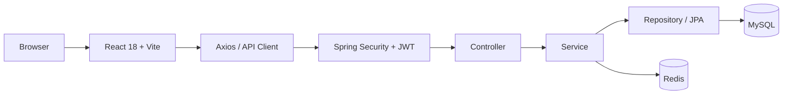
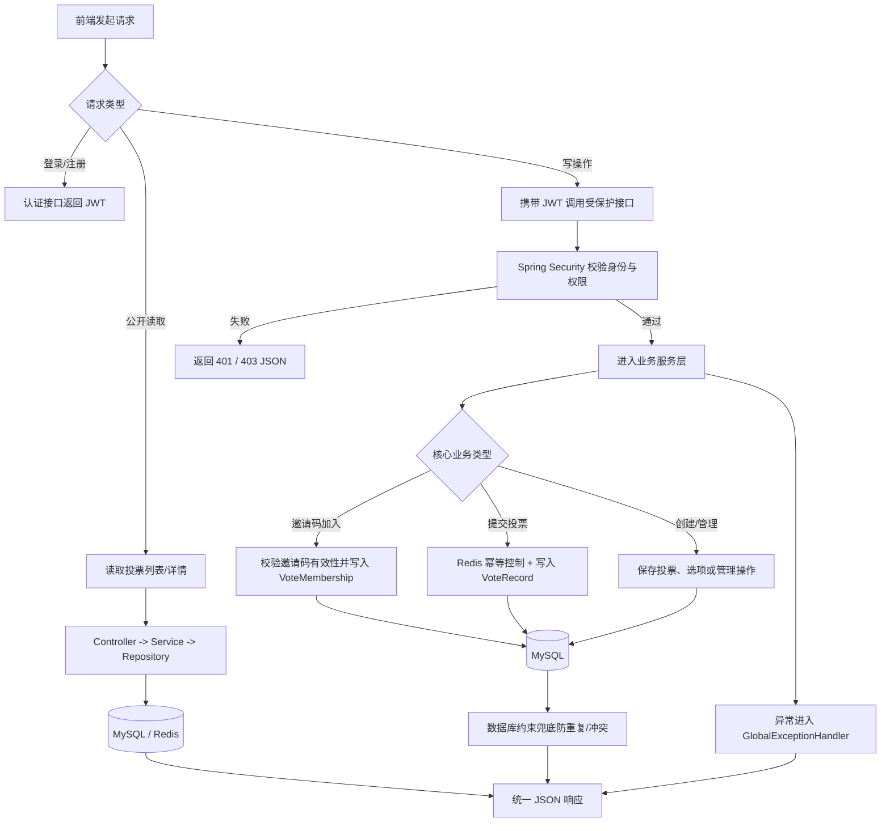
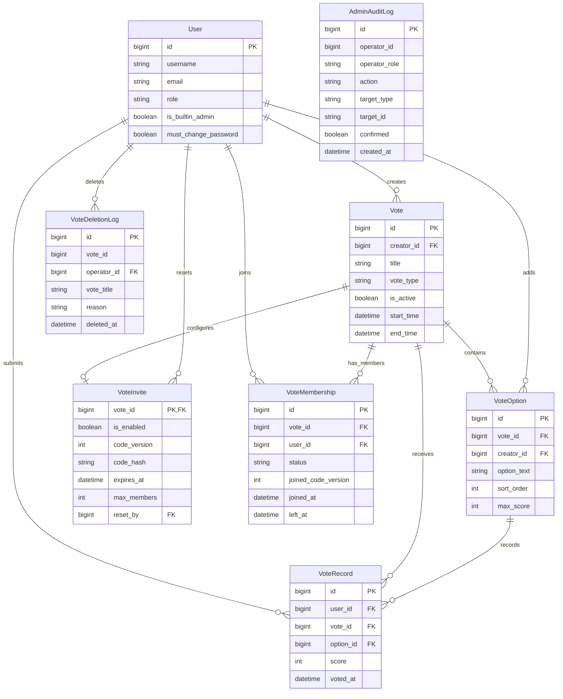

# Vote 投票系统

一个基于 Spring Boot 3 和 React 18 的面向课程实践与后端工程学习的全栈投票系统，重点实现认证鉴权、邀请码访问控制、投票业务管理及管理员后台等核心能力。

## 预览

| 登录页 | 首页 |
| --- | --- |
|  |  |
| 投票详情页 | 管理员后台 |
|  |  |

## 项目简介

- Spring Boot + React 前后端分离，接口统一返回 JSON 响应
- Spring Security + JWT 无状态认证，写接口默认要求登录
- 支持 `PUBLIC` / `INVITE` 两种访问方式，以及 `CHOICE` / `SLIDER` 两种投票模式
- 创建者或管理员可管理邀请码、重置邀请码、配置成员上限与过期时间
- 管理员后台包含概览看板、用户管理、投票规则调整与终止投票
- Redis 用于投票幂等与部分缓存链路，失效时具备降级处理
- 业务异常统一由 `ApiException + GlobalExceptionHandler` 收口

## 系统架构



## 核心业务流程



## 数据库 ER 图



## 技术栈

- 后端：Java 17, Spring Boot 3.2.4, Spring Security, Spring Data JPA, Bean Validation, JJWT, MySQL, Redis
- 前端：React 18, TypeScript, Vite, React Router, Ant Design, Axios
- 工具链：Maven, npm, Docker Compose（仅用于启动 MySQL / Redis 依赖）

## 项目结构

```text
.
├─ backend/                 # Spring Boot 后端
├─ frontend/                # React + Vite 前端
├─ docker-compose.yml       # MySQL / Redis 依赖编排
└─ .trae/documents/         # 详细设计与运维文档
```

## 快速开始

### 1. 环境要求

- Java 17
- Maven 3.9+
- Node.js 18+ 与 npm
- MySQL 8.x
- Redis
- 可选：Docker Desktop / Docker Engine（如需用容器启动依赖）

### 2. 准备后端配置

```powershell
cd backend
Copy-Item .env.example .env
```

说明：

- `backend/.env` 需要填写本地数据库、Redis 和 JWT 相关配置
- `application-dev.example.yml` 与 `application-local.example.yml` 只是模板文件；如需 profile 覆写，请先复制为本地私有配置文件再使用
- 默认 `spring.jpa.hibernate.ddl-auto=validate`，首次启动或空库场景通常需要参考 `application-local.example.yml` 做本地覆写

### 3. 启动依赖服务

如果本机已经有可用的 MySQL 和 Redis，可以跳过这一步。

```powershell
docker compose up -d
```

### 4. 启动后端

```powershell
cd backend
$env:SPRING_PROFILES_ACTIVE="local"
mvn spring-boot:run
```

### 5. 启动前端

```powershell
cd frontend
npm install
npm run dev
```

默认访问地址：

- 前端：`http://localhost:5173/`
- 后端：`http://localhost:8080/`

更完整的环境准备、配置说明和常见问题见 [.trae/documents/ops_runbook.md](.trae/documents/ops_runbook.md)。

## 当前实现范围

当前已实现：

- 用户注册、用户名或邮箱登录、JWT 鉴权
- 投票列表、投票详情、投票结果
- 登录后创建投票
- 登录后提交投票、为允许自定义选项的投票添加选项
- 邀请码加入/退出投票
- 创建者或管理员管理邀请码、重置邀请码、配置成员上限与过期时间
- 管理员概览、用户管理、投票规则调整、终止投票
- `dev/local` 环境按开关启用 `dev-token`

当前未完整落地：

- 更细粒度的独立 RBAC 权限体系
- 应用全量 Docker 交付与 CI 自动化流水线
- 前端自动化测试

## 前端路由

- `/`：投票列表首页
- `/create`：创建投票页，普通登录用户可创建投票
- `/vote/:id`：投票详情与结果页
- `/login`：登录页
- `/register`：注册页
- `/admin`：管理员后台，仅管理员可访问

## 核心接口

### 认证

- `POST /api/auth/register`
- `POST /api/auth/login`
- `GET|POST /api/auth/dev-token`（仅 `dev/local` 且显式启用时可用）

### 投票

- `GET /api/votes`
- `POST /api/votes`
- `POST /api/votes/{voteId}/vote`
- `POST /api/votes/{voteId}/join`
- `POST /api/votes/join-by-invite`
- `GET /api/votes/{voteId}/invite`

### 管理员

- `GET /api/admin/dashboard`
- `GET /api/admin/users`
- `PATCH /api/admin/users/{userId}/role`
- `POST /api/admin/votes/{voteId}/terminate`

完整接口、请求参数与响应示例见 [.trae/documents/api_contract.md](.trae/documents/api_contract.md)。

## 测试

当前后端包含 `6` 个测试类、`35` 个 `@Test`，主要分为两类：业务服务测试与安全/启动保护测试。

### 测试分类

- 业务服务测试：`2` 个测试类、`21` 个 `@Test`
  - `VoteServiceTest`：覆盖创建投票、读取详情、选择型/评分型投票、重复选项拦截、数据库唯一约束冲突翻译等
  - `AdminInviteServicesTest`：覆盖管理员二次确认、概览统计、邀请码默认值、邀请码加入、仅凭邀请码加入等
- 安全与启动保护测试：`4` 个测试类、`14` 个 `@Test`
  - `RestAuthenticationEntryPointTest`：验证未登录、token 过期、token 无效时的统一 `401` JSON 响应
  - `DevTokenBlockFilterTest`：验证 `dev-token` 只能在 `dev/local` 环境访问
  - `SensitiveConfigStartupValidatorTest`：验证敏感配置缺失、越权启用 `dev-token`、bootstrap admin 配置不完整时启动失败
  - `BootstrapAdminInitializerTest`：验证内置管理员的创建、对齐更新和冲突保护

### 示例用例

- 投票业务：`VoteServiceTest#createVote_ShouldCreateVoteAndOptions`
- 评分型投票：`VoteServiceTest#castVote_Slider_ShouldCalculateScoresCorrectly`
- 重复选择拦截：`VoteServiceTest#castVote_Choice_ShouldRejectDuplicateOptionIds`
- 邀请码加入：`AdminInviteServicesTest#joinVoteByInviteCode_ShouldResolveVoteAndActivateMembership`
- 未登录响应：`RestAuthenticationEntryPointTest#commence_ShouldReturnDefaultUnauthorizedMessage`
- 启动配置保护：`SensitiveConfigStartupValidatorTest#validate_ShouldThrowS1002_WhenDevTokenEnabledOutsideDevOrLocal`

### 后端

```powershell
cd backend
mvn test
mvn -DskipTests package
```

### 前端

```powershell
cd frontend
npm run check
npm run lint
npm run build
```

说明：

- 当前前端没有 `npm test` 脚本，也没有落地自动化测试文件

## 文档索引

- 文档总览：[.trae/documents/README.md](.trae/documents/README.md)
- 架构说明：[.trae/documents/vote_tech_arch.md](.trae/documents/vote_tech_arch.md)
- API 契约：[.trae/documents/api_contract.md](.trae/documents/api_contract.md)
- 运维手册：[.trae/documents/ops_runbook.md](.trae/documents/ops_runbook.md)
- 安全基线：[.trae/documents/security_baseline.md](.trae/documents/security_baseline.md)
- 测试策略：[.trae/documents/testing_strategy.md](.trae/documents/testing_strategy.md)

## 许可证

本项目采用 [MIT License](./LICENSE)。


